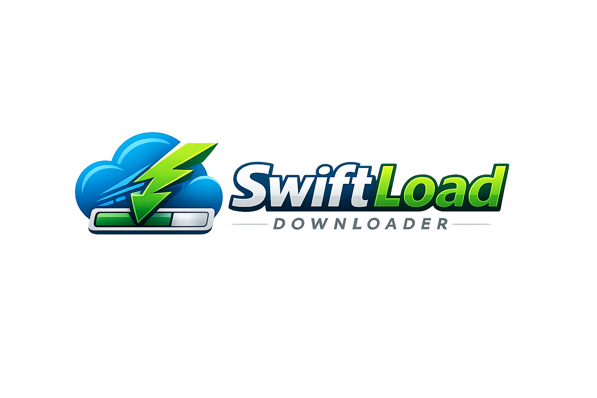

# Swiftload Downloader

<p align="center">
  
</p>

<p align="center">
  <a href="https://github.com/bhayanak/swiftload-downloader/actions/workflows/ci.yml"></a>
  <a href="https://goreportcard.com/report/github.com/bhayanak/swiftload-downloader"></a>
  <a href="https://pkg.go.dev/github.com/bhayanak/swiftload-downloader"></a>
  <a href="https://github.com/bhayanak/swiftload-downloader/releases"></a>
  <a href="LICENSE"></a>
  
</p>

A robust, cross-platform download manager with both **CLI** and **GUI**, featuring parallel chunked downloading, resume capability, and automatic retry. Built entirely in Go.

---

## Features

- **Parallel Downloading** — Splits files into chunks and downloads concurrently for maximum throughput
- **Resume Interrupted Downloads** — Crash-safe resume via `.gdown.json` metadata with ETag/Last-Modified validation
- **Automatic Retry** — Each chunk retries independently with exponential backoff; only missing bytes are re-fetched
- **Checksum Verification** — Optional MD5/SHA-256 verification after download
- **Native GUI** — Desktop GUI built with Fyne: add URLs, pause/resume, progress bars, settings
- **Standalone CLI** — Professional CLI with cobra: subcommands, shell completions, auto-filename detection
- **Cross-Platform** — Builds for macOS, Linux, and Windows from a single codebase
- **Proxy Support** — Honors HTTP\_PROXY, HTTPS\_PROXY, NO\_PROXY environment variables
- **Configurable** — Tune workers, buffer size, retries per download
- **Single Binary** — No runtime dependencies; just download and run

---

## Architecture

```
┌─────────────┐    ┌─────────────────────┐    ┌──────────────┐
│  CLI (cobra)│───▶│ pkg/engine (library)│◀───│  GUI (fyne)  │
│  cmd/gdown/ │    │ pkg/scheduler       │    │  cmd/gdown-  │
│             │    │                     │    │  gui/        │
└─────────────┘    └─────────────────────┘    └──────────────┘
```

The download engine is a **library** with zero stdout I/O — it communicates via callbacks. Both CLI and GUI are thin consumers.

---

## Installation

### CLI (Go developers)

```bash
go install github.com/bhayanak/gdown/cmd/gdown@latest
```

### Build from source

```bash
git clone https://github.com/bhayanak/gdown.git
cd gdown

# Build both CLI and GUI
make build

# Binaries are in ./bin/
./bin/gdown version
./bin/gdown-gui
```

### Cross-compile CLI for all platforms

```bash
make cross-cli
# Output in ./dist/
```

### Building

| Command | Description |
|---------|-------------|
| `make build` | Build CLI + GUI to `./bin/` |
| `make build-cli` | Build CLI only |
| `make build-gui` | Build GUI only |
| `make test` | Run all tests |
| `make lint` | Run `go vet` |
| `make cross-cli` | Cross-compile CLI for all platforms |
| `make clean` | Remove build artifacts |

---

## CLI Usage

```
gdown download <url> [flags]     # Start a new download
gdown resume <file>              # Resume from .gdown.json metadata
gdown version                    # Print version info
gdown completion <shell>         # Generate shell completions (bash/zsh/fish)
```

### Flags

| Flag | Short | Default | Description |
|------|-------|---------|-------------|
| `--output` | `-o` | auto | Destination file path |
| `--parallel` | `-p` | false | Enable parallel chunked downloading |
| `--workers` | `-w` | 16 | Number of concurrent chunk workers |
| `--retries` | `-r` | 3 | Max retry attempts per chunk |
| `--bufsize` | | 4 | Per-worker read-buffer size in MB |
| `--proxy` | | false | Use system proxy env vars |
| `--checksum` | | | Expected hash for verification |
| `--checksum-algo` | | sha256 | Hash algorithm: md5, sha256 |

### Examples

```bash
# Simple download (auto-detects filename)
gdown download https://example.com/file.iso

# Parallel download with 32 workers
gdown download https://example.com/bigfile.tar.gz -p -w 32

# Download with checksum verification
gdown download https://example.com/release.zip -o release.zip \
  --checksum abc123def456 --checksum-algo sha256

# Resume an interrupted download
gdown resume file.iso

# Generate shell completions
gdown completion zsh > ~/.zsh/completions/_gdown
```

---

## GUI Usage

Launch the Swiftload GUI:

```bash
./bin/gdown-gui
```

The GUI provides:
- **Add URL** dialog — paste URL, choose output folder, set workers
- **Download list** — filename, size, progress bar, speed, ETA
- **Per-download controls** — pause, resume, cancel
- **Settings** — default download dir, max concurrent, workers, theme

---

## Resume Capability

gdown saves download progress to a `.gdown.json` sidecar file:

1. On start → HEAD request → record ETag, Last-Modified, chunk layout
2. During download → flush chunk progress every 2 seconds
3. On interrupt (Ctrl+C / crash) → at most 2 seconds of progress lost
4. On `gdown resume` → validate server ETag/Last-Modified → resume only incomplete chunks
5. On completion → verify checksum (if provided) → delete `.gdown.json`

If the server file has changed since the download started, gdown warns and restarts from scratch.

---

## Notes

- Parallel mode pre-allocates the full output file before downloading
- If the server doesn't support Range requests, parallel mode falls back to serial automatically
- TLS certificate verification is disabled by default (for internal endpoints with self-signed certs)
- GUI binary is ~23 MB (Fyne framework); CLI is ~6 MB

---

## Requirements

- Go 1.18 or newer
- Linux, macOS, or Windows

---

## License

[MIT](LICENSE)
